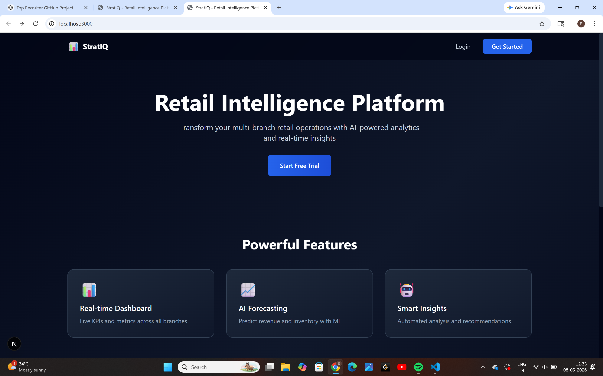
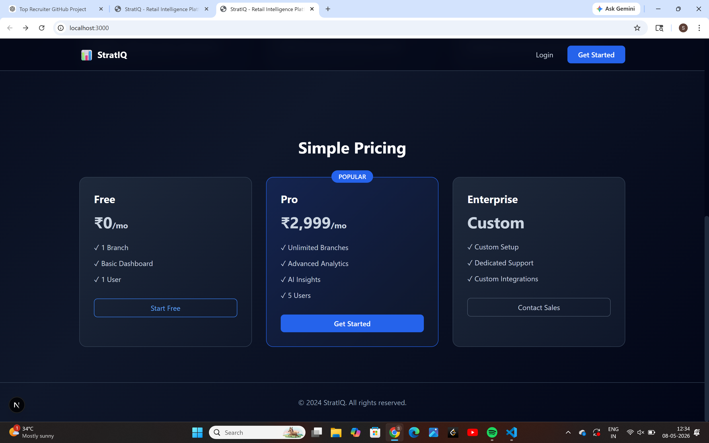
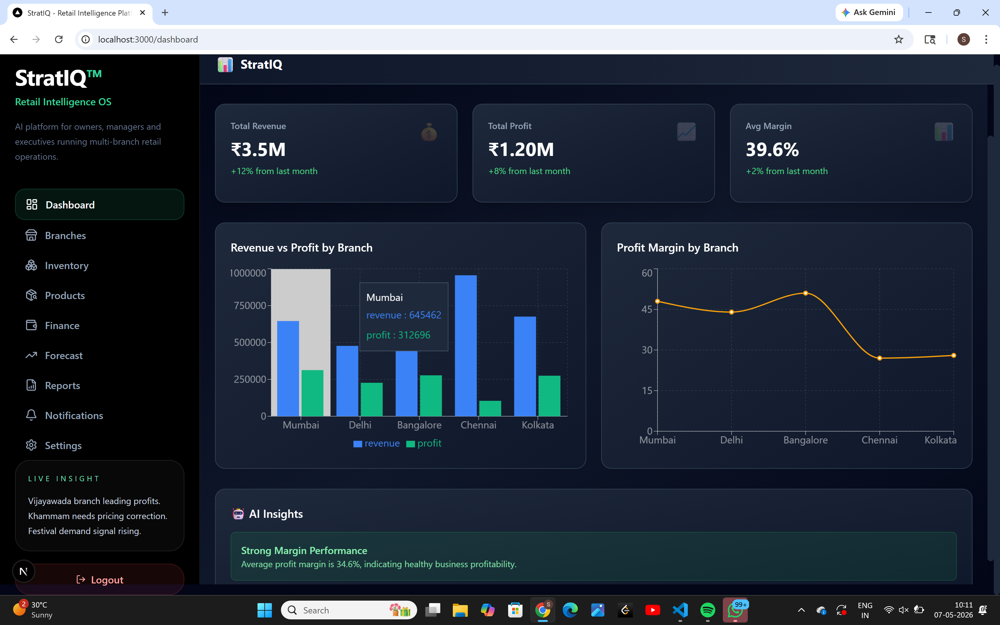

# 🚀 StratIQ — AI-Powered Retail Intelligence SaaS

StratIQ is a modern AI-powered SaaS platform built for retail businesses to monitor operations, analyze multi-branch performance, manage inventory, forecast revenue, and generate business intelligence insights in real time.

---

# 🌐 Product Overview

StratIQ enables retail owners, managers, and business teams to:

- Monitor branch performance
- Analyze revenue and profit metrics
- Track inventory insights
- Forecast future business trends
- Generate AI-driven recommendations
- Centralize operational analytics

---

# ✨ Current Features

## 📊 Analytics Dashboard
- Revenue tracking
- Profit monitoring
- Margin analytics
- Interactive business charts
- KPI overview cards

## 🏬 Branch Management
- Multi-branch analytics
- Branch comparison insights
- Performance monitoring

## 📦 Inventory Intelligence
- Product analytics
- Inventory monitoring
- Stock insights

## 🔮 Forecasting System
- Revenue forecasting
- Trend analysis
- Predictive business insights

## 🔐 SaaS Authentication
- Login & signup system
- Secure authentication flow
- Supabase integration

---

# 🛠 Tech Stack

## Frontend
- Next.js
- React
- TypeScript
- Tailwind CSS
- Chart.js

## Backend
- FastAPI
- Python

## Database & Authentication
- Supabase

## Planned Deployment
- Vercel
- Railway / Render

---

# 📸 Product Screenshots

## 🖥 Landing Page



Modern SaaS homepage with product positioning, feature highlights, and onboarding-focused UI.

---

## 💳 Pricing Section



Professional pricing architecture designed for scalable SaaS subscriptions and enterprise onboarding.

---

## 📈 Analytics Dashboard



Real-time business intelligence dashboard featuring:
- Revenue analytics
- Profit insights
- Forecasting charts
- AI-generated recommendations
- Multi-branch retail monitoring

---

# 🚧 Current Project Status

StratIQ is currently under active development.

## ✅ Completed
- SaaS UI architecture
- Landing page
- Dashboard analytics
- Forecasting module
- Authentication integration
- Multi-page routing
- Retail intelligence structure
- Responsive UI system

## 🔄 In Progress
- Advanced Supabase optimization
- AI recommendation engine
- Payment integration
- Production deployment
- Final backend optimization
- Enterprise-grade testing

---

# 🎯 Future Roadmap

- AI business assistant
- Stripe payment subscriptions
- Multi-tenant SaaS support
- Real-time notifications
- Team collaboration tools
- Advanced reporting engine
- Mobile optimization
- Enterprise integrations

---

# ⚡ Local Development Setup

```bash
git clone <repository-url>
cd stratiq-ai-retail-intelligence-saas

npm install
npm run dev
```

---

# 🧠 Why This Project Matters

StratIQ is designed as a real-world startup-oriented SaaS platform focused on solving operational intelligence challenges for retail businesses through analytics and AI-driven insights.

This project demonstrates:
- Full-stack SaaS architecture
- Modern UI/UX engineering
- Data visualization systems
- Authentication workflows
- Dashboard engineering
- Scalable product thinking

---

# 👨‍💻 Developer

### Santhosh Akkineni

Focused on building scalable SaaS products, AI-powered platforms, and modern business intelligence systems.

---

# ⭐ Repository Notes

This repository represents an actively evolving production-style SaaS application built for portfolio, learning, startup experimentation, and real-world scalability exploration.
